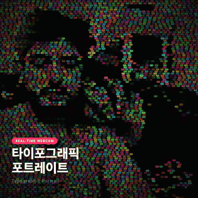

<div align="center">

# typoface

> Your face, written in words.

A real-time typographic portrait studio. Your webcam feed becomes a dense mosaic of colored pill-shaped word badges — pixel brightness drives pill opacity, and your portrait emerges letter by letter. Built with Next.js 15, the Web Canvas API, and the Web Audio API. Runs entirely on-device.

[**Live →**](https://typoface.victorgalvez.dev)



[](LICENSE)
[](https://nextjs.org)
[](https://www.typescriptlang.org)
[](https://tailwindcss.com)

Full-quality MP4: [preview.mp4](https://typoface.victorgalvez.dev/preview.mp4)

</div>

---

## Overview

Typoface captures a webcam stream, samples per-pixel luminance into typed array buffers, and rasterizes a grid of rounded "pills" whose alpha and scale track the local brightness of your face. A spring-like sine pulse, optional mic-driven envelopes, and three FX modes (Wave, Glitch, Breathe) give the grid life. Eight curated palettes and six word pools (Korean, Japanese, Arabic, English, Spanish, Custom) shape the look.

Nothing leaves the browser. No backend, no upload, no analytics — `getUserMedia` in, `<canvas>` out.

## Tech stack

| Layer       | Technology                                    |
| ----------- | --------------------------------------------- |
| Framework   | Next.js 15 (App Router) + React 18            |
| Language    | TypeScript 5                                  |
| Styling     | Tailwind CSS 3                                |
| Render      | HTML Canvas 2D + `requestAnimationFrame`      |
| Camera      | `MediaDevices.getUserMedia`                   |
| Audio       | Web Audio API — `AnalyserNode` (bass + mid)   |
| Recording   | `MediaRecorder` (WebM, VP9 / VP8 fallback)    |
| Typography  | Noto Sans KR (Google Fonts, weights 400/700/900) |

## Quick start

Requires Node ≥ 18 and a browser with camera + mic permission support.

```bash
git clone https://github.com/victorgalvez56/typoface.git
cd typoface
npm install
npm run dev
# → http://localhost:3000
```

The landing page lives at `/`; the studio is at `/studio`. On first load you'll be asked for camera access — grant it, and the portrait starts immediately.

## Architecture

A single-page client app — but the render hot path is non-trivial:

```
┌──────────────┐    ┌─────────────────┐    ┌─────────────────┐
│ getUserMedia │ →  │ off-screen      │ →  │ luminance pass  │
│ <video>      │    │ <canvas>        │    │ (Float32Array)  │
└──────────────┘    └─────────────────┘    └────────┬────────┘
                                                    │
                          ┌────────────┐            ↓
                          │ AudioCtx   │   ┌─────────────────┐
                          │ Analyser   │ → │ pill draw loop  │
                          │ (bass+mid) │   │ (rAF, ≈60fps)   │
                          └────────────┘   └─────────────────┘
```

Per frame: video → ImageData → `lumBuf` (BT.601) + `blurBuf` (22×22 block means) → for each pill, sharpen + threshold + ease → `roundRect` + glyph.

## Project structure

```
.
├── app/
│   ├── layout.tsx            # Root layout, fonts, OpenGraph metadata
│   ├── page.tsx              # Marketing landing page
│   ├── globals.css
│   └── studio/page.tsx       # The portrait studio route
├── components/
│   ├── PortraitCanvas.tsx    # Render loop — pills, luminance, FX, recording
│   ├── ControlPanel.tsx      # Top control bar (capture, theme, FX)
│   ├── SidePanel.tsx         # Collapsible left settings drawer
│   ├── StartOverlay.tsx      # Camera permission prompt
│   └── CountdownOverlay.tsx  # 3-2-1 hands-free capture overlay
├── hooks/
│   ├── useCamera.ts          # Stream lifecycle + facing-mode switching
│   ├── useLuminance.ts       # Per-frame BT.601 luminance + block-mean buffers
│   ├── usePillLayout.ts      # Density / grid / pill geometry math
│   └── useAudioReactive.ts   # AnalyserNode → bass + mid envelopes
├── lib/
│   ├── pills.ts              # Pill geometry + draw helpers
│   ├── languages.ts          # Word pools per language
│   ├── themes.ts             # 8 named palettes
│   └── constants.ts          # Tunables (block size, sharpening, thresholds)
└── public/
    ├── preview.gif
    └── preview.mp4
```

## Features

### Portrait modes

- **Multi-language word pools** — Korean (default), Japanese, Arabic, English, Spanish, or fully custom text. Custom text replaces the pool live as you type.
- **Color themes** — eight curated palettes: K-Pop, Matrix, Sakura, Ocean, Fire, Neon, Mono, Pastel. Cycle, randomize, or pick by name.
- **Density** — Normal / Dense / Micro pill sizing.
- **Contrast** — Low / Normal / High / Extreme. Applied as a CSS filter on the source canvas before luminance sampling.
- **Mirror & Invert** — flip horizontally for selfie framing; invert the luminance map so dark areas drive the pills.

### Visual effects

- **Wave** — a sine ripple sweeps across the grid, modulating pill phase.
- **Glitch** — horizontal band shifts, datamosh-style.
- **Breathe** — every pill pulses in sync — the whole portrait inhales.
- **None** — pure portrait, no motion overlay.

### Audio reactive

When enabled, an `AnalyserNode` taps your mic. Bass energy multiplies the per-pill pulse amplitude; mid energy adds a brightness boost. The portrait dances to whatever's in the room.

### Capture

- **PNG snapshot** — full-resolution download of the current frame.
- **3-2-1 timer** — animated countdown overlay for hands-free shots.
- **WebM recording** — `MediaRecorder` writes a clip; click again to stop and download.

## Controls

| Control    | Description                                                  |
| ---------- | ------------------------------------------------------------ |
| Mirror     | Flip canvas horizontally (selfie framing)                    |
| Invert     | Invert the luminance map (dark face → lit pills)             |
| Contrast   | Low / Normal / High / Extreme                                |
| Density    | Normal / Dense / Micro pill sizes                            |
| FX         | Cycle Wave → Glitch → Breathe → None                         |
| Audio      | Toggle mic-reactive pulse                                    |
| Theme      | K-Pop, Matrix, Sakura, Ocean, Fire, Neon, Mono, Pastel       |
| Random     | Randomize to a new theme                                     |
| Language   | KR · JP · AR · EN · ES · Custom                              |
| Capture    | Download PNG snapshot                                        |
| Timer      | 3-2-1 countdown then capture                                 |
| Record     | Start / stop WebM recording                                  |

### Keyboard shortcuts

| Key     | Action                |
| ------- | --------------------- |
| `M`     | Toggle mirror         |
| `I`     | Toggle invert         |
| `C`     | Capture PNG           |
| `R`     | Start / stop recording|
| `Space` | Randomize color theme |

## How it works

1. `getUserMedia` feeds a hidden `<video>` element.
2. Each frame, the video is drawn to an off-screen `<canvas>` with a CSS contrast filter applied.
3. `useLuminance` reads the raw RGBA pixels and builds two `Float32Array` buffers:
   - `lumBuf`: BT.601 luminance per pixel
   - `blurBuf`: 22×22 block means (cheap unsharp-mask kernel)
4. For each pill, sampled luminance is sharpened: `lum + (lum - blockMean) * 1.6`.
5. Alpha = `pow((lum − threshold) / (1 − threshold), 0.75)`, then a per-pill sine pulse modulates alpha + scale.
6. If audio is on, bass multiplies pulse amplitude and mid adds brightness.
7. FX modes (Wave / Glitch / Breathe) shift positions and phase.
8. Pills are drawn as `ctx.roundRect(...)` plus a centered glyph from the active word pool.

## Contributing

PRs welcome. The repo is small enough to read top-to-bottom in an afternoon — most of the visual logic lives in `components/PortraitCanvas.tsx` and the four hooks under `hooks/`.

1. **Fork → clone → branch** (`git checkout -b feat/your-thing`)
2. Run locally with `npm run dev` (see [Quick start](#quick-start))
3. Keep changes scoped — one feature/fix per PR
4. Match the existing style: 2-space indent, single quotes, semicolons, `const` over `let`
5. **No formatting-only commits** mixed with logic changes
6. Open a PR with a short description of *why* the change matters, not *what*

### Good first issues

- **New language pool** — add Hebrew, Cyrillic, Greek, Hindi, Thai, etc. to `lib/languages.ts` with a flag emoji and 30–50 short words
- **New color theme** — add a palette to `lib/themes.ts` (5–7 hex colors works well)
- **New FX mode** — extend the FX cycle in `PortraitCanvas.tsx` (e.g. Spiral, Scanline, Drift)
- **MP4 export** — currently recording is WebM only; transcode in-browser via a Web Worker
- **Camera switcher** — front/back toggle for mobile (already wired into `useCamera` — needs UI)
- **Preset save/load** — serialize current settings to `localStorage` or a shareable URL hash
- **Customizable keybindings** — surface the `M / I / C / R / Space` map in the side panel

### Conventions

- **Commits**: imperative present tense, no trailing period (`Add Hebrew word pool`, not `Added Hebrew word pool.`)
- **Tunables**: lift magic numbers (block size, sharpening factor, alpha curve exponent) into `lib/constants.ts` with a one-line comment naming the effect
- **Hooks**: one concern per hook — don't fold audio logic into `useCamera`, etc.
